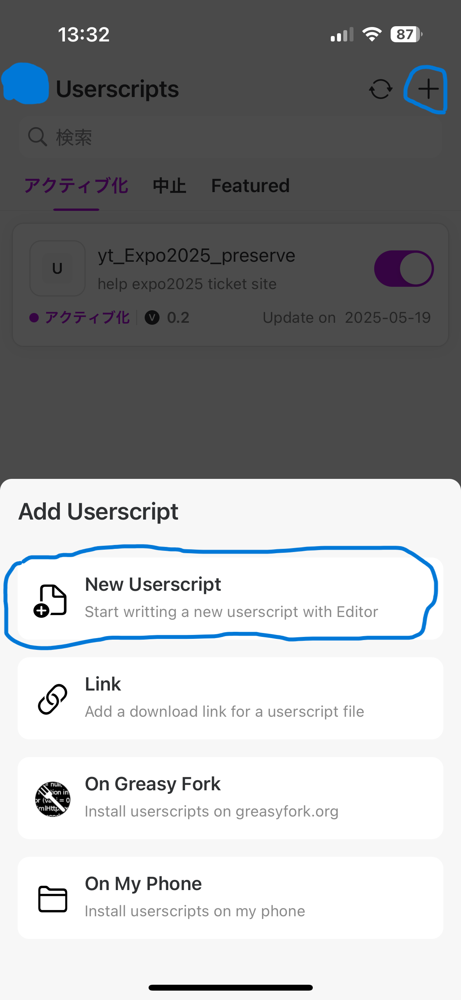
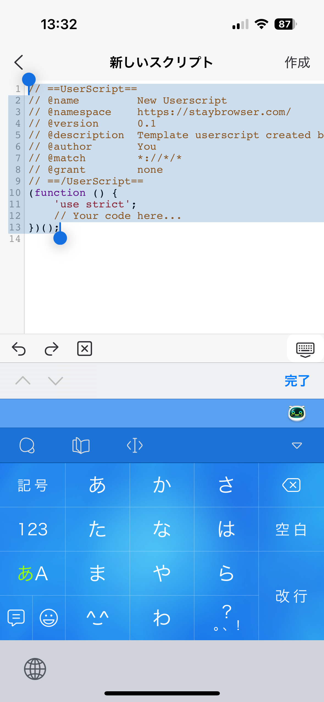

# yt Expo2025 先着予約 Helper

このアプリでは、2025年の大阪万博における先着予約を支援するための機能を提供します。
当日予約および三日前予約(空き枠予約)で利用できます。

Safari on iOS, Chrome on Windowsで動作確認済みです。

- [Feature](#feature)
  - [全件読み込み](#全件読み込み)
  - [空きあり絞り込み](#空きあり絞り込み)
  - [検索結果コピー](#検索結果コピー)
  - [追加絞り込み](#追加絞り込み)

## Feature

パビリオン・イベント検索画面に、上図のようにいくつかのボタンと入力欄が追加されます。
最初に検索画面に遷移した際はボタンが追加されませんが、一度検索を実行して画面読み込みが完了すると、ボタンが追加されます。

それらと機能の一覧は次の通りです。

| 画面要素 | 機能 | 説明 |
| --- | --- | --- |
| 「すべて読み込み」ボタン | 全件読み込み | 「もっと見る」を自動でクリックし、全件読み込みます。 |
|「空きのみ」ボタン | 空きあり絞り込み | 空きのパビリオン・イベントのみを絞り込んで表示します。もう一度クリックすると、先の絞り込みを解除します。 |
| 「一覧コピー」ボタン | 検索結果コピー | 検索結果のパビリオン・イベントの名前一覧をクリップボードへコピーします。 |
| 「読み込みなし絞り込み」入力欄 | 追加絞り込み | 画面の読み込みなしで、検索結果を絞り込みます。マイナス検索などをサポートします。 |
| 「絞込」ボタン | 追加絞り込み | 同上 |

### 全件読み込み

通常の検索結果画面では、何度も画面をスクロールして「もっと見る」ボタンをクリックしないと、すべてのパビリオン・イベントを読み込むことができません。~~アラブ首長国連邦やイタリアのパビリオンの当日予約が埋まりやすいのはきっとこれも一因。~~

「すべて読み込み」ボタンをクリックすると、全件読み込みが開始されます。
読み込みが完全に完了するまで繰り返しボタンの自動クリックと読み込みを繰り返します。
しばらく画面が変化し続けるので、しばらくお待ちください。
完了すると「すべて読み込み」ボタンが灰色で自動操作が止まります。

### 空きあり絞り込み

この検索画面には絞り込み機能がもともとありますが、なんとこれではパビリオンかイベントかの絞り込みしか行えません。~~空いてるパビリオンだけ表示させないのは混雑対策だとでもいうのか……いや、そうかも……。~~

「空きのみ」ボタンを押下すると、表示されているパビリオン・イベントの中から、予約枠に空きのあるものだけを絞り込んで、表示します。このとき、ボタンは灰色になります。
もう一度押下すると、絞り込みが解除され、ボタンは緑色に戻ります。

### 検索結果コピー

空きあり絞り込み機能で絞り込みを行った後、いずれかのパビリオンの個別画面に遷移したのち戻った場合、全件読み込みの結果は失われます。
戻るたびに、全件読み込みを何度も行う必要があるのでしょうか……。~~面倒な。~~

一度全件読み込みを行って、空きのみ絞り込みを行った時点で、検索結果コピーを行っておきましょう。クリップボードにその時点でのパビリオン・イベントの名前一覧がコピーされます。
これをメモ帳などに保存しておけば、全件読み込みの結果が失われたとしても、各パビリオン・イベントを個別に検索して表示することで、より効率的に予約を試みることができます。

LINEなどで共有すれば、他の人と協力することもできますね。

### 追加絞り込み

通常の検索では、必ず画面の読み込みが行われます。
混雑しているタイミングでは検索のたびに待ち時間が発生することもあり、歯がゆい仕様です。
情報が更新されなくてもいいから、絞り込んでパッと把握したいということもあるでしょう。

また、通常の検索では単純な一致による判定しか行われません。
~~ヘルスケアで検索するたびに登場するアラブ首長国連邦パビリオン。~~

この追加絞り込みでは、以下のように少し複雑な絞り込みが行えます。

| 表記 | 機能 | 説明 |
| --- | --- | --- |
| word1 word2 | AND検索 | word1とword2の両方を含むものを表示します。 区切り文字は半角空白、全角空白、and、ANDに対応します|
| word1 or word2 | OR検索 | word1またはword2のいずれかを含むものを表示します。 区切り文字はor、ORに対応します|
| word1 -word2 | NOT検索 | word1を含み、word2を含まないものを表示します。 マイナス記号の直後の単語を除外検索します|

以下はさらに高度な絞り込みです。興味がある場合のみご覧ください。

| 表記 | 機能 | 説明 |
| --- | --- | --- |
| word1 "This is a pen" | フレーズ検索 | word1を含み、"This is a pen"を含むものを表示します。後者は空白を含みますが、 分割されずに検索されます|
| (word1 word2) or word3 or word4 | グループ検索 | word1とword2の両方を含むもの、またはword3を含むもの、またはword4を含むものを表示します。 半角括弧でグループ化することで、論理の包含関係を明確にできます。括弧の内部の空白は例の通り省略できます|

## Install

### Safari on iOS

Stayというアプリを利用して、本アプリのソースコードをSafariの拡張機能として認識させます。
作者はMacを持っていないので、iOSアプリの作成や納品はできないのです……。

1. App Storeから[Stay](https://apps.apple.com/jp/app/stay-for-safari/id1591620171)をインストールします。

2. ブラウザでGitHubの本リポジトリを開き、`src/index.js`を開きます: [link](https://github.com/TomoTom0/expo2025-extension/blob/master/src/index.js)。

3. ファイル内容直上右上の三点メニューボタンを押下し、Copyを選択してファイル内容をコピーします。

4. Stayを開き、右上の+ボタンを押下し、「New Userscript」を選択します。

5. ファイルの内容をすべて選択して、コピーした内容をペーストします。

6. 右上の作成を押下して、戻ります。

7. Safariを開き、アドレスバーの左側をクリックして、拡張機能を管理を選択します。

8. 単に「Stay」とある項目をオンにします。

ここまでで、インストールは完了です。
あとはSafariで万博の先着予約画面を開いて検索を実行すると、緑色のボタンが追加されているはずです。

### Chrome on Windows

Coming Soon...

## 問い合わせ

- [Google Forms](https://docs.google.com/forms/d/e/1FAIpQLSdh2wRCUWpX6ZLfma-g5O46eD93wOPHpDHWQGxdOcJLmm_tGQ/viewform?usp=pp_url&entry.1848091360=Expo2025+%E5%85%88%E7%9D%80%E4%BA%88%E7%B4%84+Helper)
- Gmail: tomoIris427+GitHub@gmail.com

