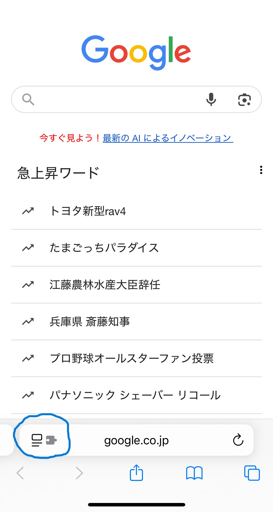

# Expo2025予約補助

このアプリでは、2025年の大阪万博における先着予約を支援するための機能を提供します。

Safari on iOS, Chrome on Windowsで動作確認済みです。  
パビリオン・イベント検索画面、入場予約画面、チケット選択画面に対応しています。

- [Expo2025予約補助](#Expo2025予約補助)
  - [Feature](#feature)
    - [パビリオン・イベント検索画面](#パビリオンイベント検索画面)
    - [全件読み込み](#全件読み込み)
    - [空きあり絞り込み](#空きあり絞り込み)
    - [検索結果コピー](#検索結果コピー)
    - [追加絞り込み](#追加絞り込み)
    - [入場予約画面](#入場予約画面)
      - [入場予約自動化](#入場予約自動化)
    - [チケット選択・同行者追加画面](#チケット選択同行者追加画面)
      - [同行者追加自動化](#同行者追加自動化)
      - [日付単位チケット選択機能](#日付単位チケット選択機能)
  - [Install and Update](#install-and-update)
    - [Safari on iOS](#safari-on-ios)
    - [Chrome on Windows](#chrome-on-windows)
  - [問い合わせ](#問い合わせ)

## Feature

### パビリオン・イベント検索画面

パビリオン・イベント検索画面に、上図のようにいくつかのボタンと入力欄が追加されます。
最初に検索画面に遷移した際はボタンが追加されないことがありますが、
一度検索を実行して画面読み込みが完了すると、ボタンが追加されます。
(この画面のボタンのデザインは変更されており、画像のものとは異なる場合があります)

それらと機能の一覧は次の通りです。

| 画面要素 | 機能 | 説明 |
| --- | --- | --- |
| 「すべて読み込み」ボタン | 全件読み込み | 「もっと見る」を自動でクリックし、全件読み込みます。 |
|「空きのみ」ボタン | 空きあり絞り込み | 空きのパビリオン・イベントのみを絞り込んで表示します。もう一度クリックすると、先の絞り込みを解除します。 |
| 「一覧コピー」ボタン | 検索結果コピー | 検索結果のパビリオン・イベントの名前一覧をクリップボードへコピーします。 |
| 「読み込みなし絞り込み」入力欄 | 追加絞り込み | 画面の読み込みなしで、検索結果を絞り込みます。マイナス検索などをサポートします。 |
| 「絞込」ボタン | 追加絞り込み | 同上 |

### 全件読み込み

通常の検索結果画面では、何度も画面をスクロールして「もっと見る」ボタンをクリックしないと、すべてのパビリオン・イベントを読み込むことができません。~~アラブ首長国連邦やイタリアのパビリオンの当日予約が埋まりやすいのはきっとこれも一因。~~

「すべて読み込み」ボタンをクリックすると、全件読み込みが開始されます。
読み込みが完全に完了するまで繰り返しボタンの自動クリックと読み込みを繰り返します。
しばらく画面が変化し続けるので、しばらくお待ちください。
完了すると「すべて読み込み」ボタンが灰色で自動操作が止まります。

### 空きあり絞り込み

この検索画面には絞り込み機能がもともとありますが、なんとこれではパビリオンかイベントかの絞り込みしか行えません。~~空いてるパビリオンだけ表示させないのは混雑対策だとでもいうのか……いや、そうかも……。~~

「空きのみ」ボタンを押下すると、表示されているパビリオン・イベントの中から、予約枠に空きのあるものだけを絞り込んで、表示します。このとき、ボタンは灰色になります。
もう一度押下すると、絞り込みが解除され、ボタンは緑色に戻ります。

### 検索結果コピー

空きあり絞り込み機能で絞り込みを行った後、いずれかのパビリオンの個別画面に遷移したのち戻った場合、全件読み込みの結果は失われます。
戻るたびに、全件読み込みを何度も行う必要があるのでしょうか……。~~面倒な。~~

一度全件読み込みを行って、空きのみ絞り込みを行った時点で、検索結果コピーを行っておきましょう。クリップボードにその時点でのパビリオン・イベントの名前一覧がコピーされます。
これをメモ帳などに保存しておけば、全件読み込みの結果が失われたとしても、各パビリオン・イベントを個別に検索して表示することで、より効率的に予約を試みることができます。

LINEなどで共有すれば、他の人と協力することもできますね。

### 追加絞り込み

通常の検索では、必ず画面の読み込みが行われます。
混雑しているタイミングでは検索のたびに待ち時間が発生することもあり、歯がゆい仕様です。
情報が更新されなくてもいいから、絞り込んでパッと把握したいということもあるでしょう。

また、通常の検索では単純な一致による判定しか行われません。
~~ヘルスケアで検索するたびに登場するアラブ首長国連邦パビリオン。~~

この追加絞り込みでは、以下のように少し複雑な絞り込みが行えます。

| 表記 | 機能 | 説明 |
| --- | --- | --- |
| word1 word2 | AND検索 | word1とword2の両方を含むものを表示します。 区切り文字は半角空白、全角空白、and、ANDに対応します|
| word1 or word2 | OR検索 | word1またはword2のいずれかを含むものを表示します。 区切り文字はor、ORに対応します|
| word1 -word2 | NOT検索 | word1を含み、word2を含まないものを表示します。 マイナス記号の直後の単語を除外検索します|

以下はさらに高度な絞り込みです。興味がある場合のみご覧ください。

| 表記 | 機能 | 説明 |
| --- | --- | --- |
| word1 "This is a pen" | フレーズ検索 | word1を含み、"This is a pen"を含むものを表示します。後者は空白を含みますが、 分割されずに検索されます|
| (word1 word2) or word3 or word4 | グループ検索 | word1とword2の両方を含むもの、またはword3を含むもの、またはword4を含むものを表示します。 半角括弧でグループ化することで、論理の包含関係を明確にできます。括弧の内部の空白は例の通り省略できます|

### 入場予約画面

入場予約画面では、満員時間帯も含めた自動予約機能が利用できます。

| 画面要素 | 機能 | 説明 |
| --- | --- | --- |
| 右下FABの「予約開始」ボタン | 入場予約自動化 | 満員時間帯も含めて予約成功まで自動でリトライを繰り返します。 |

#### 入場予約自動化

時間帯を選択して「予約開始」ボタンを押下すると、予約成功まで自動で予約リトライを継続します。
満員時間帯も含めて制限なく試行し、失敗時には適切な間隔で待機してから再試行します。

無事予約成功すると上記の画面となります。

### チケット選択・同行者追加画面

チケット選択画面と同行者追加画面で、複数人分の予約を効率化する機能が利用できます。

| 画面要素 | 機能 | 説明 |
| --- | --- | --- |
| 右下FABメインボタン（チケット選択画面） | FAB展開・収納 | 同行者追加機能の子ボタンを展開・収納します。 |
| 「同行者チケット」ボタン | 同行者追加自動化 | 同行者チケット管理ダイアログを開きます。 |
| 「選択日付」ボタン | 日付選択自動化 | 利用可能な日付を自動検出し、選択を補助します。 |

#### 同行者追加自動化

大阪万博では複数人分まとめて予約ができますが、事前に一人ずつチケットIDを入力することになります。
しかも恐ろしいことに、ブラウザで戻ったり更新したりすると同行者情報が失われます。
もちろん、前回の入力情報が記憶されていることもありません。
さあまた全員分のチケットIDの入力しなおしです。~~正気の沙汰じゃない。~~

「同行者チケット」ボタンを押下して、同行者チケット管理ダイアログを開きます。

このダイアログでは、同行者チケットIDを登録・管理できます。

登録の際にはラベルを付与して、誰のチケットかをわかりやすく管理できます。
空白の場合は登録日時が表示されます。

チケットIDを選択して「同行者追加」を実行すると、全員分のチケットIDが同行者として追加されます。
その間、チケットID画面と同行者追加画面を自動で行き来します。

デフォルトでは、なぜか同行者チケットID追加後にチケット選択画面に戻ると、
そのチケットIDのすべての入場予約が選択される仕様です。
当然、一度に複数日分の予約はできないので不要な分を解除する必要があります。
~~公式が通期パスアンチ。~~
なので、この拡張機能では、チケット選択画面に戻った際に、自動で選択を解除しています。

#### 日付単位チケット選択機能

右下のFABにある「選択日付」ボタンを押下すると、対象の日付のチケットだけ選択された状態になります。
日付は自動で検出され、最大3つのボタンが表示されます。
チケットに含まれる日付のうち、直近の日付、次の日付、その次の日付(4種類以上の日付がある場合は日付部分がカスタム)となります。

## Install and Update

### Safari on iOS

Stayというアプリを利用して、本アプリのソースコードをSafariの拡張機能として認識させます。
作者はMacを持っていないので、iOSアプリの作成や納品はできないのです……。

1. App Storeから[Stay](https://apps.apple.com/jp/app/stay-for-safari/id1591620171)をインストールします。

2. ブラウザでGitHubの本リポジトリを開き、`src/index.js`を開きます: [link](https://github.com/TomoTom0/expo2025-extension/blob/master/src/index.js)。

3. ファイル内容直上右上の三点メニューボタンを押下し、Viewを選択して、遷移先でブラウザのURLをコピーします。

4. Stayを開き、右上の+ボタンを押下し、「Link」を選択します。

5. 「ペーストを許可」→「Continue」をタップで貼り付けられて、更新されます。(ペーストを許可が出ない場合、手動で貼り付けてください)

6. 右上の作成を押下して、戻ります。

7. Safariを開き、アドレスバーの左側をクリックして、拡張機能を管理を選択します。

8. 単に「Stay」とある項目をオンにします。

ここまでで、インストールは完了です。
あとはSafariで万博の先着予約画面を開いて検索を実行すると、この拡張機能のボタンが追加されているはずです。

#### Update

拡張機能のUpdateは、Installの場合の「2-5」を実行してください。
既存の機能を削除せずとも更新されます。

### Chrome on Windows

1. [Releases](https://github.com/TomoTom0/Expo2025-Reservation-Helper/releases)から最新の`src.zip`をダウンロードして展開します。

2. Chromeの拡張機能管理画面を開きます：
   - アドレスバーに `chrome://extensions/` と入力してEnter
   - または、Chrome右上の三点メニュー → 拡張機能 → 拡張機能を管理

3. 右上の「デベロッパーモード」を有効にします。

4. 「パッケージ化されていない拡張機能を読み込む」をクリックし、展開した`src`フォルダを選択します。

5. 拡張機能が追加されたら、[大阪万博サイト](https://ticket.expo2025.or.jp/)にアクセスして動作確認してください。

## 問い合わせ

- [Google Forms](https://docs.google.com/forms/d/e/1FAIpQLSdh2wRCUWpX6ZLfma-g5O46eD93wOPHpDHWQGxdOcJLmm_tGQ/viewform?usp=pp_url&entry.1848091360=Expo2025+%E5%85%88%E7%9D%80%E4%BA%88%E7%B4%84+Helper)
- Gmail: tomoIris427+GitHub@gmail.com

